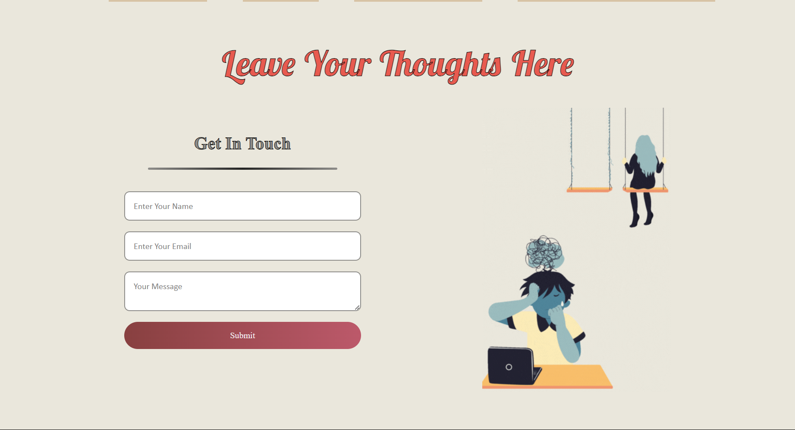

    <h1><b>We Care 🤝🏼</b></h1>
    <h5>Where Hope and Healing Meets</h5>

  

<h3> Abstract: </h3>
We Care is your go-to platform for mental wellness and good health. We're on a mission to help you build a positive mindset for life's challenges. This is your one-stop destination for a healthier you, our platform is all about making well-being simple and accessible to all. Let this site illuminate your path to emotional well-being!!

<h3> Features: 5 pillars that form the backbone of the platform </h3>

1. <b>Resource Library 📚</b>
    

      
    

    

        Self-Help Videos:
        Curated library for empowering mental health videos.
        Blogs and Articles:
        Expert-authored content for informed well-being.
        Helpline Contacts:
        Quick access to immediate support contacts.
        Affirmations and Quotes:
        Daily affirmations and motivational quotes.
        Mindfulness Exercises:
        Guided exercises for stress reduction and mindfulness.
        &nbsp;
    

    &nbsp;

2. <b>Find Doctors 👨‍⚕️</b>
    

      
    

    

        Search and Find:
        Effortlessly search and discover qualified mental health professionals.
        Detailed Information:
        Access comprehensive details, including experience, expertise, fees, and location.
        Contact Details for Booking:
        Seamless access to contact details for easy booking when needed. 
    

    &nbsp;
 
3. <b> Psychometric Test 📝</b>
    

      
    

    

        User-Friendly Assessment:
        Engage in a user-friendly psychometric test for mental well-being assessment.
        Personalized Report:
        Receive a customized report based on test responses for a nuanced understanding.
        Insightful Analysis:
        Gain insightful analysis to enhance self-awareness and mental health insights. 
    

    &nbsp;

4. <b> The NLP-Bot "Comet" 🤖</b>
    

      
    

    

        Real-Time Support:
        Instant access to a chatbot for immediate emotional support.
        Conversational Interaction:
        Engage in natural and empathetic conversations for a personalized experience.
        Mental Wellness Buzzwords:
        Receive assistance and information on mental wellness buzzwords and topics.  
    

    &nbsp;

5. <b> Get-In-Touch via Email (Real-Time) 📧</b>
    

      
    

    

        This allows the users to fill in whatever they wish to share with our team, and the real-time form response will be received at our end. This allows us to get back to them personally with possible solutions.  
    

    &nbsp;

<h3> Tech-Stack: </h3>
    1. Python  
    2. Natural Language Processing  
    3. HTML and CSS  
    4. Javascript  
    5. APIs  

<h3>Use and Set Up</h3>

    1. The website is deployed at - https://we-care-omega.vercel.app/  
    2. For the backend to run on your machine, clone this repostory into your local machine  
    3. Install required libraries using commands in the requirements.txt  
    4. Run the server.py file  
     
    Now you have everything in place, use the website link above to interact with We Care.

